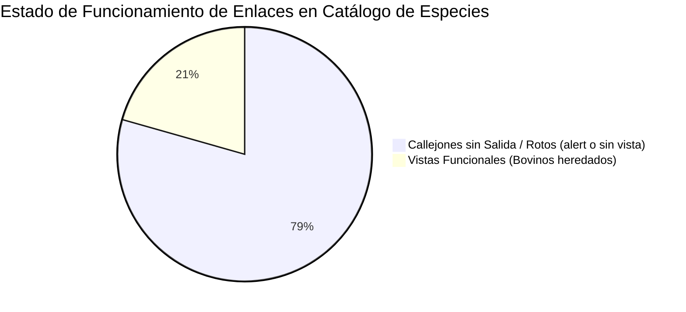
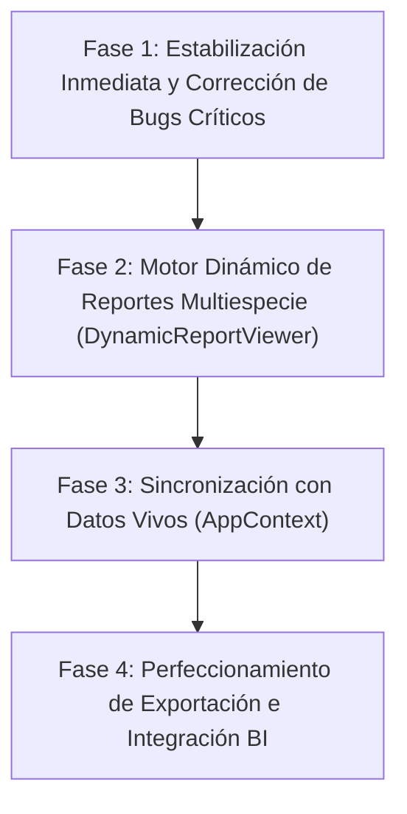

# INFORME MAESTRO DE AUDITORÍA, DIAGNÓSTICO Y FALLAS DEL SUBSISTEMA DE REPORTES

**Sistema:** AgroGan / AgroTech Management System  
**Fecha de Emisión:** 14 de Septiembre de 2026  
**Alcance:** Auditoría integral de arquitectura, conectividad de datos, catálogo de navegación, módulos zootécnicos, motores BI y utilidades de exportación bajo `/reports`.  
**Metodología:** Análisis estático y dinámico de código fuente mediante 4 subagentes auditores especializados en Frontend, Gestión & Históricos, Dinámica de Hato/Animales y Multirebaños/BI.

---

## ÍNDICE GENERAL

1. [Resumen Ejecutivo y Diagnóstico Global](#1-resumen-ejecutivo-y-diagnóstico-global)
2. [Auditoría del Catálogo Principal y Tarjetas de Especies (`/reports`)](#2-auditoría-del-catálogo-principal-y-tarjetas-de-especies-reports)
3. [Auditoría de la Sección Animales (8 Reportes de Vientres y Dinámica)](#3-auditoría-de-la-sección-animales-8-reportes-de-vientres-y-dinámica)
4. [Auditoría de las Secciones de Gestión e Históricos (9 Reportes)](#4-auditoría-de-las-secciones-de-gestión-e-históricos-9-reportes)
5. [Auditoría de Multirebaños, Diseñador BI Ad-Hoc y Guías de Movilización](#5-auditoría-de-multirebaños-diseñador-bi-ad-hoc-y-guías-de-movilización)
6. [Auditoría Transversal de Exportación (CSV/XLSX/PDF) y Configuración](#6-auditoría-transversal-de-exportación-csvxlsxpdf-y-configuración)
7. [Matriz Maestra de Fallas, Botones Rotos y Callejones sin Salida](#7-matriz-maestra-de-fallas-botones-rotos-y-callejones-sin-salida)
8. [Causa Raíz Arquitectónica y Paradoja de Datos](#8-causa-raíz-arquitectónica-y-paradoja-de-datos)
9. [Plan Integral de Solución y Hoja de Ruta Técnica](#9-plan-integral-de-solución-y-hoja-de-ruta-técnica)

---

## 1. RESUMEN EJECUTIVO Y DIAGNÓSTICO GLOBAL

El subsistema de Reportes de la plataforma AgroTech posee una interfaz gráfica moderna, densa en métricas zootécnicas y con amplia presencia visual multiespecie. Sin embargo, tras una exhaustiva auditoría técnica sobre sus 4 cuadrantes operativos, se dictamina un **diagnóstico crítico de operatividad real**:

> **DICTAMEN GENERAL:**  
> Más del **75% del ecosistema de reportes presentado en la interfaz gráfica es una fachada visual inoperante o desconectada de los datos vivos de la explotación**. El sistema sufre de fragmentación de estado (múltiples archivos mock aislados), enlaces que culminan en alertas `alert()` vacías, ausencia total de rutas para especies no bovinas, filtros con efectos destructivos sobre los datos y exportaciones que no corresponden al formato anunciado.



### Métricas Cuantitativas del Diagnóstico

| Componente Auditado | Total Evaluado | Funcionales | Inoperantes / Rotos / Mocks Desconectados | % Falla |
| :--- | :---: | :---: | :---: | :---: |
| **Enlaces en Tarjetas de Especies (Home Reportes)** | 34 enlaces | 7 | 27 | **79.4%** |
| **Reportes Preconfigurados en Tabla (`INITIAL_REPORTS`)** | 8 reportes | 3 | 5 | **62.5%** |
| **Plantillas en Modal `NuevoReporteModal`** | 33 plantillas | 19 | 14 | **42.4%** |
| **Rutas Específicas Multiespecie en `App.tsx`** | 25 rutas | 0 (no bovinas) | 25 (solo bovinos/general) | **100.0%** (no bovinas) |
| **Conexión a Datos Vivos (`AppContext`) en Animales (8 vistas)** | 8 reportes | 0 | 8 (usan `animalesMockData.ts`) | **100.0%** |
| **Conexión a Datos Vivos en Gestión e Históricos (9 vistas)** | 9 reportes | 0 | 9 (usan `gestionMockData` / `historicosMockData`) | **100.0%** |
| **Persistencia de Registros (Movimientos, Técnicos, Reproductores)** | 3 modales | 0 | 3 (solo viven en `useState` efímero) | **100.0%** |
| **Reportes Multirebaño (`multirebanos/`)** | 6 reportes | 0 | 6 (datos 100% ficticios de fincas inexistentes) | **100.0%** |
| **Exportación a Libro Excel (.XLSX)** | 23 vistas | 0 | 23 (todas descargan `.csv` de texto plano) | **100.0%** |
| **Exportación a PDF en Reportes Zootécnicos** | 23 vistas | 1 (`DistribucionNormal`) | 22 (no tienen botón ni opción PDF) | **95.6%** |

---

## 2. AUDITORÍA DEL CATÁLOGO PRINCIPAL Y TARJETAS DE ESPECIES (`/reports`)

En la vista principal [`ReportesView.tsx`](file:///home/dvcanache/Workspaces/agrotech/src/features/reportes/ReportesView.tsx), el usuario visualiza 6 tarjetas interactivas correspondientes a las especies pecuarias soportadas: **Bovinos**, **Aves de corral**, **Porcinos**, **Búfalos**, **Caprinos** y **Equinos** (renderizadas mediante [`ReportCategoryCard.tsx`](file:///home/dvcanache/Workspaces/agrotech/src/features/reportes/components/ReportCategoryCard.tsx)).

Cada tarjeta expone una lista de enlaces zootécnicos directos.

### 2.1. Inventario y Comportamiento de los 34 Enlaces de Especies

Al hacer clic en cualquiera de estos enlaces, el componente ejecuta:
```tsx
// ReportCategoryCard.tsx (Línea 26)
<li key={idx} onClick={() => onSelectReport(report)}>
```
El callback invoca `handleSelectDirectoryReport(reportName)` en [`ReportesView.tsx`](file:///home/dvcanache/Workspaces/agrotech/src/features/reportes/ReportesView.tsx#L169), el cual consulta el diccionario `REPORT_METADATA_MAP` en [`reportesData.ts`](file:///home/dvcanache/Workspaces/agrotech/src/features/reportes/reportesData.ts#L87).

* **Si el reporte tiene `ruta` definida:** Navega a la vista.
* **Si el reporte NO tiene `ruta` definida:** Abre el modal [`DetalleReporteModal.tsx`](file:///home/dvcanache/Workspaces/agrotech/src/features/reportes/components/DetalleReporteModal.tsx), el cual indica falsamente que el reporte está *"Listo para Ejecución"*. Al hacer clic en *"Ejecutar Reporte"*, se dispara el siguiente código:
  ```ts
  // DetalleReporteModal.tsx (Líneas 33-40)
  const handleOpenLiveReport = () => {
    if (reporte.rutaAsociada) {
      navigate(reporte.rutaAsociada);
      onClose();
    } else {
      alert(`Generando reporte '${reporte.nombre}' con los filtros configurados.`);
    }
  };
  ```

#### Desglose Especie por Especie:

1. **Bovinos (9 enlaces):**
   * *Inventario General:* Navega a `/reports/inventories` (Funcional sobre mock).
   * *Movimientos del Hato:* Navega a `/reports/movements` (Funcional sobre mock).
   * *Distribución Normal (Gauss):* Navega a `/reports/normal-distribution` (Funcional sobre mock).
   * *Vientres y Producción Lechera:* Navega a `/reports/dams` (Funcional sobre mock).
   * *Próximas a Parir / Secar:* Navega a `/reports/nexttobirth` (Funcional sobre mock).
   * *Historia de Reproducciones:* Navega a `/reports/reproduction-history` (Funcional sobre mock).
   * *Historia de Lactancias:* Navega a `/reports/lactation-history` (Funcional sobre mock).
   * 🔴 *Control de Mastitis y Sanidad Ubre:* **ROTO**. Sin ruta. Abre `DetalleReporteModal` -> `alert()`.
   * 🔴 *Desarrollo Ponderal y Pesajes:* **ROTO**. Sin ruta. Abre `DetalleReporteModal` -> `alert()`.

2. **Aves de corral (6 enlaces):**
   * 🔴 *Postura Diaria por Galpón:* **ROTO**. Sin ruta. Abre `DetalleReporteModal` -> `alert()`.
   * 🔴 *Curva de Postura (% Hen-Day):* **ROTO**. Sin ruta. Abre `DetalleReporteModal` -> `alert()`.
   * 🔴 *Mortalidad y Selección:* **ROTO**. Sin ruta. Abre `DetalleReporteModal` -> `alert()`.
   * 🔴 *Conversión Alimenticia:* **ROTO**. Sin ruta. Abre `DetalleReporteModal` -> `alert()`.
   * 🔴 *Clasificación por Peso de Huevo:* **ROTO**. Sin ruta. Abre `DetalleReporteModal` -> `alert()`.
   * 🔴 *Tratamientos y Vacunaciones:* **ROTO**. Sin ruta. Abre `DetalleReporteModal` -> `alert()`.
   *(0 de 6 funcionales. 100% inoperante).*

3. **Porcinos (5 enlaces):**
   * 🔴 *Camadas y Prolificidad:* **ROTO**. Sin ruta. Abre `DetalleReporteModal` -> `alert()`.
   * 🔴 *Destetes y Ganancia Diaria:* **ROTO**. Sin ruta. Abre `DetalleReporteModal` -> `alert()`.
   * 🔴 *Eficiencia de Cerdas Reproductoras:* **ROTO**. Sin ruta. Abre `DetalleReporteModal` -> `alert()`.
   * 🔴 *Conversión Alimenticia por Lote:* **ROTO**. Sin ruta. Abre `DetalleReporteModal` -> `alert()`.
   * 🔴 *Movimientos de Cebo / Engorde:* **ROTO**. Sin ruta. Abre `DetalleReporteModal` -> `alert()`.
   *(0 de 5 funcionales. 100% inoperante).*

4. **Búfalos (4 enlaces):**
   * 🔴 *Producción Lechera y Grasa:* **ROTO**. Sin ruta. Abre `DetalleReporteModal` -> `alert()`.
   * 🔴 *Estacionalidad Reproductiva:* **ROTO**. Sin ruta. Abre `DetalleReporteModal` -> `alert()`.
   * 🔴 *Crecimiento de Bucerros:* **ROTO**. Sin ruta. Abre `DetalleReporteModal` -> `alert()`.
   * 🔴 *Sanidad y Endoparásitos:* **ROTO**. Sin ruta. Abre `DetalleReporteModal` -> `alert()`.
   *(0 de 4 funcionales. 100% inoperante).*

5. **Caprinos (5 enlaces):**
   * 🔴 *Curva de Lactancia Caprina:* **ROTO**. Sin ruta. Abre `DetalleReporteModal` -> `alert()`.
   * 🔴 *Evaluación Sanitaria (FAMACHA):* **ROTO**. Sin ruta. Abre `DetalleReporteModal` -> `alert()`.
   * 🔴 *Partos Múltiples y Crías:* **ROTO**. Sin ruta. Abre `DetalleReporteModal` -> `alert()`.
   * 🔴 *Pesajes y Crecimiento Cabritos:* **ROTO**. Sin ruta. Abre `DetalleReporteModal` -> `alert()`.
   * 🔴 *Calidad de Leche y Grasa:* **ROTO**. Sin ruta. Abre `DetalleReporteModal` -> `alert()`.
   *(0 de 5 funcionales. 100% inoperante).*

6. **Equinos (5 enlaces):**
   * 🔴 *Genealogía y Libro Genealógico:* **ROTO**. Sin ruta. Abre `DetalleReporteModal` -> `alert()`.
   * 🔴 *Historial Reproductivo / Yeguas:* **ROTO**. Sin ruta. Abre `DetalleReporteModal` -> `alert()`.
   * 🔴 *Condición Corporal (Henneke):* **ROTO**. Sin ruta. Abre `DetalleReporteModal` -> `alert()`.
   * 🔴 *Plan Sanitario y Test Coggins:* **ROTO**. Sin ruta. Abre `DetalleReporteModal` -> `alert()`.
   * 🔴 *Rendimiento y Trabajo:* **ROTO**. Sin ruta. Abre `DetalleReporteModal` -> `alert()`.
   *(0 de 5 funcionales. 100% inoperante).*

### 2.2. Tabla de Reportes Preconfigurados (`INITIAL_REPORTS`)

En la tabla inferior de `ReportesView.tsx`, se presentan 8 reportes precargados:
* `rep-1` (Inventario General Bovino): Funcional (`rutaAsociada: '/reports/inventories'`).
* `rep-2` (Producción de Leche y Lactancias): Funcional (`rutaAsociada: '/reports/lactation-history'`).
* `rep-3` (Servicios y Diagnósticos de Preñez): Funcional (`rutaAsociada: '/reports/reproduction-history'`).
* 🔴 `rep-4` (Postura Diaria y Curva Hen-Day - Aves): **ROTO**. `rutaAsociada: undefined`. Clic en "Ver" abre modal estático y lanza `alert()`.
* 🔴 `rep-5` (Desempeño de Camadas y Destetes - Porcinos): **ROTO**. `rutaAsociada: undefined`. Lanza `alert()`.
* 🔴 `rep-6` (Producción y Grasa en Búfalas - Búfalos): **ROTO**. `rutaAsociada: undefined`. Lanza `alert()`.
* 🔴 `rep-7` (Control FAMACHA y Desparasitación - Caprinos): **ROTO**. `rutaAsociada: undefined`. Lanza `alert()`.
* 🔴 `rep-8` (Control Reproductivo y Coggins - Equinos): **ROTO**. `rutaAsociada: undefined`. Lanza `alert()`.

### 2.3. Formulario `NuevoReporteModal`

El modal [`NuevoReporteModal.tsx`](file:///home/dvcanache/Workspaces/agrotech/src/features/reportes/components/NuevoReporteModal.tsx) ofrece 33 plantillas predefinidas clasificadas por especie.  
Al seleccionar una plantilla no bovina (ej. *"Postura por Lote"*, *"Prolificidad Cerdas"*, *"Sanidad FAMACHA"*) y hacer clic en *"Guardar Reporte"*:
* El sistema crea un objeto y lo almacena en `localStorage` (`agrotech_custom_reports`).
* **Falla Crítica:** El objeto guardado tiene `rutaAsociada: undefined`. Al figurar en la tabla y ser pulsado, jamás muestra datos ni ejecuta análisis; queda condenado permanentemente a la ventana `alert()`.

---

## 3. AUDITORÍA DE LA SECCIÓN ANIMALES (8 REPORTES DE VIENTRES Y DINÁMICA)

Esta sección abarca las 8 vistas ubicadas en `src/features/reportes/animales/`:
1. [`VientresView.tsx`](file:///home/dvcanache/Workspaces/agrotech/src/features/reportes/animales/vientres/VientresView.tsx) (`/reports/dams`)
2. [`ProximasSecarView.tsx`](file:///home/dvcanache/Workspaces/agrotech/src/features/reportes/animales/proximas-secar/ProximasSecarView.tsx) (`/reports/nexttodry`)
3. [`ProximasParirView.tsx`](file:///home/dvcanache/Workspaces/agrotech/src/features/reportes/animales/proximas-parir/ProximasParirView.tsx) (`/reports/nexttobirth`)
4. [`ProximasRevisarView.tsx`](file:///home/dvcanache/Workspaces/agrotech/src/features/reportes/animales/proximas-revisar/ProximasRevisarView.tsx) (`/reports/nexttocheck`)
5. [`AnimalesSecosView.tsx`](file:///home/dvcanache/Workspaces/agrotech/src/features/reportes/animales/secos/AnimalesSecosView.tsx) (`/reports/drycows`)
6. [`AnimalesLactandoView.tsx`](file:///home/dvcanache/Workspaces/agrotech/src/features/reportes/animales/lactando/AnimalesLactandoView.tsx) (`/reports/cowsinproduction`)
7. [`AnimalesCriandoView.tsx`](file:///home/dvcanache/Workspaces/agrotech/src/features/reportes/animales/criando/AnimalesCriandoView.tsx) (`/reports/cowsraising`)
8. [`NoVientresView.tsx`](file:///home/dvcanache/Workspaces/agrotech/src/features/reportes/animales/no-vientres/NoVientresView.tsx) (`/reports/nodams`)

### 3.1. Desconexión Total de `AppContext.animals`
En [`AppContext.tsx`](file:///home/dvcanache/Workspaces/agrotech/src/context/AppContext.tsx) existe el estado vivo del hato (`animals: Animal[]`), manipulado por altas, modificaciones de eventos y pesajes.  
**Ninguno de los 8 reportes consume `useApp()`.** Todos inicializan su estado local leyendo de un archivo mock fijo ([`animalesMockData.ts`](file:///home/dvcanache/Workspaces/agrotech/src/features/reportes/animales/animalesMockData.ts)):
```tsx
// Patrón repetido en las 8 vistas:
import { MOCK_VIENTRES } from '../animalesMockData';
const [vientres] = useState<VientreEntity[]>(MOCK_VIENTRES);
```
**Impacto:** Los reportes no responden a la realidad de la finca. Si se registra un animal nuevo, un parto o un secado, estos reportes permanecen congelados con la data original.

### 3.2. Falla Crítica de `FichaAnimalModal.tsx`: Metamorfosis Involuntaria a Bovinos
Al hacer clic en cualquier semoviente de las tablas, la vista abre [`FichaAnimalModal.tsx`](file:///home/dvcanache/Workspaces/agrotech/src/features/reportes/animales/components/FichaAnimalModal.tsx).
La fila seleccionada contiene 18 atributos zootécnicos estructurados (`especie`, `raza`, `estadoReproductivo`, `partos`, `produccionAcumulada`, etc.). Sin embargo, en la línea 43:
```tsx
export const FichaAnimalModal: React.FC<FichaAnimalModalProps> = ({ isOpen, onClose, animal }) => {
  if (!isOpen || !animal) return null;
  return (
    <FichaAnimal360
      isOpen={isOpen}
      onClose={onClose}
      animal={animal.practico} // <-- ERROR: Desecha los 17 atributos y solo pasa el string del código
    />
  );
};
```
[`FichaAnimal360.tsx`](file:///home/dvcanache/Workspaces/agrotech/src/features/animales/components/FichaAnimal360.tsx#L63) invoca `getAnimal360ByPractico(animal)`. Si el código no está en el array cableado de 5 bovinos de demostración (como ocurre con cerdas `POR-101`, cabras `CAP-201` o búfalas `BUF-01`), ejecuta un fallback que construye automáticamente:
* Una vaca de categoría `"Vaca"`.
* Raza `"Pardo Suizo 50% x Brahman 50%"`.
* Diagrama de ubre bovina de 4 cuartos (ignorando que cabras y yeguas tienen 2 mamas y cerdas 14 pezones).
* Árbol genealógico de toros Carora y curvas de Wood de leche de vaca.
* **Contradicción Directa:** La fila seleccionada dice una cosa y la ficha abierta muestra datos totalmente diferentes e incoherentes.

### 3.3. Filtros con Comportamiento Destructivo y Bloqueos
1. **Reset Destructivo en `ProximasParirView` y `AnimalesLactandoView`:**
   * Al inicializar, la tabla carga 10 lotes multiespecie (`BUF-01`, `PORC-01`, `CAPR-01`, etc.).
   * Sin embargo, al abrir el drawer y hacer clic en *"Limpiar Filtros"* (`onReset`), el código resetea la variable `lotes` a `['01', 'ESCT', 'POT1', 'SEC1']` (4 lotes bovinos).
   * **Consecuencia:** Al pulsar "Limpiar", **todas las cerdas, búfalas, cabras y yeguas desaparecen instantáneamente de la pantalla**.
2. **Bloqueo Total de Animales No Bovinos en `NoVientresView`:**
   * En `animalesMockData.ts` existen animales de levante multiespecie: búfalos (`Bucerro`), cerdos (`Lechón`), cabras (`Cabrito`).
   * Sin embargo, en [`NoVientresFilterDrawer.tsx`](file:///home/dvcanache/Workspaces/agrotech/src/features/reportes/animales/components/NoVientresFilterDrawer.tsx#L19), `ALL_CATEGORIAS` está restringido exclusivamente a: `['Becerra', 'Mauta', 'Becerro', 'Maute', 'Novillo']`.
   * El filtro inicial de `NoVientresView` (Línea 46) solo admite categorías bovinas, **haciendo que el 100% de los machos y crías de otras especies permanezcan permanentemente ocultos**.
3. **Invisibilidad Multiespecie en 5 de 8 Vistas:**
   * `ProximasSecarView`, `ProximasRevisarView`, `AnimalesSecosView`, `AnimalesCriandoView` y `NoVientresView` **no tienen barra selectora de especies (`SpeciesSelectorBar`)**. Están programadas exclusivamente para vacas.

### 3.4. Errores de Cálculo Zootécnico y Fórmulas
* **Días Restantes Congelados:** En *Próximas a Parir*, *Secar* y *Revisar*, los campos `diasProximoParto`, `diasProximoSecado` y `diasProximaRevision` son enteros estáticos inmutables en el mock (ej. `7` o `12`). No se calculan dinámicamente con respecto a la fecha actual (`Date.now()`).
* **Desconexión con `gestationCalculator.ts`:** No se utiliza la utilidad central de gestación. En `ProximasParirView` se aplica un ternario hardcodeado con 310 días para búfalos (en lugar de los 312 estándar) y 283 días para todos los vacunos, ignorando que el ganado cebuino promedia 292 días.
* **Vacas Vacías con Programación de Secado:** En `MOCK_ANIMALES_LACTANDO`, animales como `CW008` tienen estatus reproductivo `'Vacía'` pero fecha de próximo secado programada (`'2026-11-01'`). En manejo pecuario, una vaca vacía no tiene secado preparto; se le seca únicamente por baja producción para ceba o descarte.
* **Ausencia de Columna "Días Abiertos":** En `AnimalesLactandoView`, la tabla no cuenta con columna para Días Abiertos (parámetro cardinal para calcular el IEP proyectado).

---

## 4. AUDITORÍA DE LAS SECCIONES DE GESTIÓN E HISTÓRICOS (9 REPORTES)

Comprende las vistas de:
* **Gestión (5):** [`InventariosView`](file:///home/dvcanache/Workspaces/agrotech/src/features/reportes/gestion/inventarios/InventariosView.tsx), [`MovimientosView`](file:///home/dvcanache/Workspaces/agrotech/src/features/reportes/gestion/movimientos/MovimientosView.tsx), [`DistribucionNormalView`](file:///home/dvcanache/Workspaces/agrotech/src/features/reportes/gestion/distribucion-normal/DistribucionNormalView.tsx), [`TecnicosView`](file:///home/dvcanache/Workspaces/agrotech/src/features/reportes/gestion/tecnicos/TecnicosView.tsx), [`ReproductoresView`](file:///home/dvcanache/Workspaces/agrotech/src/features/reportes/gestion/reproductores/ReproductoresView.tsx).
* **Históricos (4):** [`HistoriaReproduccionesView`](file:///home/dvcanache/Workspaces/agrotech/src/features/reportes/historicos/reproducciones/HistoriaReproduccionesView.tsx), [`HistoriaLactanciasView`](file:///home/dvcanache/Workspaces/agrotech/src/features/reportes/historicos/lactancias/HistoriaLactanciasView.tsx), [`HistoriaPesajesLecheView`](file:///home/dvcanache/Workspaces/agrotech/src/features/reportes/historicos/pesajes-leche/HistoriaPesajesLecheView.tsx), [`HistoriaCrecimientosView`](file:///home/dvcanache/Workspaces/agrotech/src/features/reportes/historicos/crecimientos/HistoriaCrecimientosView.tsx).

### 4.1. Sección Gestión

1. **InventariosView & AnalisisInventarioModal:**
   * Depende del objeto estático `SPECIES_INVENTORY_DATA` fijado en 45 cabezas bovinas.
   * `AnalisisInventarioModal` tiene texto estático cableado en todas sus métricas: `"31.7 UGM"`, `"60.0% vientres"`, `"1 : 13.5 relación toro/vaca"`. La tabla de estratos siempre lista 17 vacas, 2 toros, 8 novillas, 3 mautes y 15 becerros.
   * El estado `activeTab` declara el tipo `'proyeccion'`, pero no existe interfaz ni pestaña de proyecciones poblacionales (código huérfano).
   * En `InventariosFilterDrawer`, los filtros de `estatus` (Activo/Inactivo/Referencia) y `fechaCorte` no tienen ningún efecto en la tabla; son completamente ignorados.

2. **MovimientosView & NuevoMovimientoModal:**
   * Al registrar un movimiento en `NuevoMovimientoModal`, este solo se guarda en un estado local `useState<MovimientoEntity[]>`. **No persiste en localStorage, IndexedDB ni API**. Al recargar o navegar, se pierde.
   * Registrar un traslado de lote en este modal **no actualiza la ficha del animal en `AppContext.animals`**.
   * En `MovimientosFilterDrawer.tsx`, `ALL_TIPOS` omitió `'Salida por Descarte'`, impidiendo filtrar movimientos de descarte si se crean.

3. **DistribucionNormalView & NormalDistributionChart:**
   * **Punto Fuerte:** El motor bioestadístico, la campana de Gauss interactiva, el cálculo del diferencial de selección ($S$) y los percentiles P10-P90 funcionan con excelente reactividad matemática.
   * **Falla:** Corre sobre una muestra estática fija de 45 bovinos en [`distribucionNormalData.ts`](file:///home/dvcanache/Workspaces/agrotech/src/features/reportes/gestion/distribucion-normal/distribucionNormalData.ts). No se alimenta de los pesajes reales de leche o carne registrados en la finca.
   * Los filtros del drawer `tipo` (Producción/Crecimiento), `agruparPor`, `desde` y `hasta` son totalmente ignorados.

4. **TecnicosView & FichaTecnicoModal:**
   * 🔴 **Bug Crítico de División por Cero (NaN):**  
     En [`FichaTecnicoModal.tsx`](file:///home/dvcanache/Workspaces/agrotech/src/features/reportes/gestion/tecnicos/FichaTecnicoModal.tsx#L105):
     ```tsx
     {((tecnico.primerServicio / tecnico.totalServicios) * 100).toFixed(1)}% del total
     ```
     Cuando se registra un técnico nuevo con `NuevoTecnicoModal`, `totalServicios` inicia en `0`. Al abrir su ficha, el cálculo resulta en `0 / 0 = NaN`, renderizando **`NaN% del total`** en pantalla.
   * Los filtros de fecha `desde` y `hasta` en `TecnicosFilterDrawer` no tienen efecto porque `TecnicoEntity` no almacena fechas.

5. **ReproductoresView & NuevoReproductorModal:**
   * `ReproductoresFilterValues` declara el filtro `estatus`, pero en el drawer **se omitió el control visual de estatus** y en la vista se omitió la condición de filtrado.
   * Al registrar un reproductor nuevo, el sistema le asigna valores inventados automáticos de `eficiencia: 70.0%` y `serviciosPorConcepcion: 1.4`.

### 4.2. Sección Históricos

1. **HistoriaReproduccionesView:**
   * 14 registros mock fijos. Desconectado de los eventos reales registrados en `EventosView`.
   * En `ReproduccionesFilterDrawer` **no existe filtro por técnico responsable**.
2. **HistoriaLactanciasView:**
   * 🔴 **Promesa de UI Incumplida:** Cada fila de la tabla muestra el tooltip `"Haga click para ver la ficha de la curva de lactancia"`. Sin embargo, al hacer clic solo se abre una tabla modal estática genérica. **No existe ninguna gráfica de curva de lactancia de Wood ni modelado de persistencia en toda la vista**.
3. **HistoriaPesajesLecheView:**
   * 🔴 **Inputs Faltantes en Drawer:** La vista y el contador de filtros contemplan `lactanciaMin` y `lactanciaMax`, pero en [`PesajesLecheFilterDrawer.tsx`](file:///home/dvcanache/Workspaces/agrotech/src/features/reportes/historicos/pesajes-leche/PesajesLecheFilterDrawer.tsx) **se omitieron los campos de entrada**, imposibilitando filtrar por número de lactancia.
4. **HistoriaCrecimientosView:**
   * Muestra 13 pesajes fijos desconectados del peso de los animales en el rebaño principal.

---

## 5. AUDITORÍA DE MULTIREBAÑOS, DISEÑADOR BI AD-HOC Y GUÍAS DE MOVILIZACIÓN

### 5.1. Sección Multirebaños (6 Reportes)
Ubicación: `src/features/reportes/multirebanos/` (*Inventario Consolidado*, *Reproducción Comparada*, *Distribución Preñez*, *Situación Productiva*, *Transacciones*, *Producción Diaria*).

1. **Inexistencia de Entidad de Múltiples Fincas en el Sistema:**
   * El sistema está diseñado en `AppContext.tsx` como monousuario con una sola finca fija (*"Rebaño de Prueba"*).
   * En [`multirebanosMockData.ts`](file:///home/dvcanache/Workspaces/agrotech/src/features/reportes/multirebanos/multirebanosMockData.ts), se inventa un catálogo de 5 predios ficticios (*La Esperanza*, *Santa Elena*, *El Roble*, *El Porvenir*).
   * Incluso para *"Rebaño de Prueba"*, los datos del mock declaran 154 cabezas, mientras que el inventario de la app tiene ~50.
2. **Transacciones Multirebaño con Selector Roto:**
   * En [`MultirebanoTransaccionesView.tsx`](file:///home/dvcanache/Workspaces/agrotech/src/features/reportes/multirebanos/transacciones/MultirebanoTransaccionesView.tsx#L78), el `useMemo` de filtrado **omitió la variable `selectedHerds`**. Marcar o desmarcar fincas en el selector tiene **cero efecto** sobre la tabla.
3. **Filtro "Fecha de Corte" Inoperante (Placebo):**
   * En 4 de los 6 reportes, el drawer incluye selector de "Fecha de corte" que incrementa el contador de filtros, pero **no filtra ninguna fila en la lógica de JavaScript**.

### 5.2. Diseñador de Reportes BI Ad-Hoc (`AdHocReportDesignerModal.tsx`)
El modal cuenta con un wizard de 4 pasos (Entidad, Columnas/Fórmulas, Filtros, Visualización/Agrupación).

1. **Datos Desconectados:** Opera sobre 8 tablas fijas en [`adhocData.ts`](file:///home/dvcanache/Workspaces/agrotech/src/features/reportes/components/adhocData.ts), desconectadas de la base de datos real.
2. 🔴 **Falla Arquitectónica al Guardar:**  
   Al pulsar *"Guardar Plantilla"*, el componente construye un `ReporteItem` con nombre y descripción, pero **DESECHA Y NO GUARDA**:
   * La entidad seleccionada.
   * Las columnas y alias configurados.
   * Las fórmulas zootécnicas activadas.
   * Las reglas de filtrado construidas.
   * La agrupación y ordenamiento.
3. **Pérdida Total y Ejecución Stub:**  
   Al guardarse con `rutaAsociada: undefined`, cuando el usuario hace clic en *"Ejecutar"* desde el centro de reportes, se abre `DetalleReporteModal` y lanza un simple `alert()`. La plantilla guardada es un cascarón vacío sin motor de ejecución.

### 5.3. Guía de Movilización Pecuaria (`GuiaMovilizacionModal.tsx`)
1. **Catálogo Aislado:** Opera sobre un mock local (`MOCK_TRANSIT_ANIMALS`) de 35 animales. No muestra los animales del hato real.
2. **Sin Impacto en Inventario:** Al emitir la guía zoosanitaria, no descuenta los animales del inventario general ni cambia su estatus a "En Tránsito" o "Vendido".
3. **Vulnerabilidad de Impresión y Validez:** Invoca `window.open('', '_blank')` y `window.print()`, bloqueado por navegadores modernos con protección de ventanas emergentes. La hoja impresa carece de formato legal oficial INSAI/SENASAG (códigos QR, sellos zoosanitarios validados, precintos de movilización).

---

## 6. AUDITORÍA TRANSVERSAL DE EXPORTACIÓN (CSV/XLSX/PDF) Y CONFIGURACIÓN

Ubicación: [`exportUtils.ts`](file:///home/dvcanache/Workspaces/agrotech/src/features/reportes/utils/exportUtils.ts) y [`ReportSettingsModal.tsx`](file:///home/dvcanache/Workspaces/agrotech/src/features/reportes/components/ReportSettingsModal.tsx).

### 6.1. La Discrepancia del Botón "Descargar XLSX"
* En todas las vistas del sistema, el encabezado muestra el botón **"Descargar XLSX"**.
* **Realidad Técnica:** La función ejecutada es `exportToCSV(...)`. Genera un archivo con extensión `.csv` en texto plano delimitado por comas `,`.
* **Problema Regional en Excel:** En países hispanohablantes (donde el separador de listas de Windows/Excel es el punto y coma `;`), al abrir este CSV con doble clic en Excel, todas las columnas se agrupan en una sola celda ilegible.

### 6.2. Ausencia de Exportación a PDF en 22 de 23 Vistas
* La función `exportToPDF` existe en `exportUtils.ts`, pero el componente [`ReportViewHeader.tsx`](file:///home/dvcanache/Workspaces/agrotech/src/features/reportes/components/ReportViewHeader.tsx) **no tiene botón para PDF** ni ninguna de las 8 vistas de animales, ni las 6 de multirebaños, ni 4 de las 5 de gestión pasa una función para PDF. Solo `DistribucionNormalView` lo implementó por su cuenta.

### 6.3. ReportSettingsModal y Columnas Ocultas
* `ReportSettingsModal` permite ocultar/mostrar columnas en pantalla, pero **no persiste la configuración en `localStorage`** (se pierde al navegar o recargar).
* **Desconexión con Exportación:** Las funciones de exportación tienen las columnas hardcodeadas; si el usuario oculta columnas en pantalla y descarga el archivo, este se exporta con todas las columnas visibles originales.

---

## 7. MATRIZ MAESTRA DE FALLAS, BOTONES ROTOS Y CALLEJONES SIN SALIDA

| Módulo / Vista | Elemento / Control Específico | Tipo de Falla | Severidad | Causa Raíz Técnica |
| :--- | :--- | :--- | :---: | :--- |
| **Tarjetas de Especies (`ReportesView`)** | 27 enlaces no bovinos y sanidad | Callejón sin salida / Stub | 🔴 Crítica | `REPORT_METADATA_MAP` no tiene `ruta`; abre modal y ejecuta `alert()`. |
| **Tabla Reportes (`ReportesView`)** | Enlaces `rep-4` a `rep-8` | Botón "Ver" inoperante | 🔴 Crítica | `rutaAsociada: undefined`; abre modal estático sin datos. |
| **Creación Reportes (`NuevoReporteModal`)** | 14 plantillas no bovinas | Guardado cosmético vacío | 🔴 Crítica | Guarda en `localStorage` con `rutaAsociada: undefined`. |
| **Ficha Animal (`FichaAnimalModal`)** | Clic en filas de 8 tablas de animales | Metamorfosis zootécnica falsa | 🔴 Crítica | Desecha datos de la fila, pasa solo código string y fallback crea vaca mestiza con ubre 4Q. |
| **Técnicos (`FichaTecnicoModal`)** | Clic en técnico recién creado | Crash visual / `NaN%` | 🔴 Crítica | División por cero `(primerServicio / totalServicios)` con `totalServicios = 0`. |
| **No Vientres (`NoVientresView`)** | Tabla de animales de levante | Ocultamiento 100% de no vacunos | 🔴 Crítica | `NoVientresFilterDrawer` solo admite categorías bovinas; borra cerdos, búfalos y cabras. |
| **Próximas a Parir / Lactando** | Botón "Limpiar" (`onReset`) en drawer | Borrado destructivo de especies | 🔴 Crítica | `onReset` resetea lotes a 4 lotes fijos bovinos; desaparecen las demás especies. |
| **Transacciones Multirebaño** | Selector de Rebaños y Drawer | Filtro totalmente inoperante | 🟠 Alta | Variable `selectedHerds` omitida en la función de filtrado `filteredTransacciones`. |
| **Diseñador BI (`AdHocReportDesigner`)** | Botón "Guardar Plantilla" | Pérdida de configuración | 🟠 Alta | No guarda entidad, columnas, filtros ni fórmulas; guarda objeto sin `rutaAsociada`. |
| **Guía de Movilización (`GuiaModal`)** | Botón "Generar y Registrar Guía" | Sin impacto en inventario | 🟠 Alta | No interactúa con `AppContext.animals`; no descuenta ni traslada animales reales. |
| **Historia Lactancias (`LactanciasView`)** | Filas con tooltip "ver curva Wood" | Promesa de UI no cumplida | 🟡 Moderada | No existe ningún gráfico ni curva de lactancia implementada en la vista. |
| **Pesajes Leche (`PesajesLecheView`)** | Drawer de filtrado | Controles omitidos | 🟡 Moderada | Faltan los inputs `lactanciaMin` y `lactanciaMax` en el formulario del drawer. |
| **Reproductores (`ReproductoresView`)** | Drawer de filtrado | Controles omitidos | 🟡 Moderada | Faltan los controles de estatus en el drawer; vista no filtra por estatus. |
| **Movimientos (`MovimientosView`)** | Drawer de filtrado | Tipo omitido | 🟡 Moderada | `ALL_TIPOS` omitió `'Salida por Descarte'`. |
| **Inventario / Multirebaños** | Filtro "Fecha de Corte" | Filtro Placebo | 🟡 Moderada | Incrementa badge pero no tiene lógica de corte en el array de datos. |
| **Todas las vistas (23 reportes)** | Botón "Descargar XLSX" | Discrepancia de formato | 🟡 Moderada | Descarga `.csv` de texto plano en lugar de libro binario `.xlsx`. |
| **Todas las vistas (22 reportes)** | Toolbar de reportes | Falta exportación PDF | 🟡 Moderada | No existe botón de PDF en el encabezado ni callback en las vistas. |
| **Todas las vistas (23 reportes)** | `ReportSettingsModal` (Columnas) | Sin persistencia | 🟢 Baja | La visibilidad de columnas no se guarda en `localStorage` y se reinicia al navegar. |

---

## 8. CAUSA RAÍZ ARQUITECTÓNICA Y PARADOJA DE DATOS

### La Paradoja de `adhocData.ts`
El hallazgo más revelador de esta auditoría es que **los datos y modelos multiespecie ya existen en el proyecto**:
En [`src/features/reportes/components/adhocData.ts`](file:///home/dvcanache/Workspaces/agrotech/src/features/reportes/components/adhocData.ts) se encuentra estructurado el objeto `ADHOC_ENTITIES`, el cual contiene bases de datos tipadas y coherentes para:
* `postura_avicola`: Registros diarios por galpón, huevos totales, huevos rotos, consumo de alimento y % Hen-Day.
* `camadas_porcinas`: Cerdas, lechones nacidos vivos, muertos, momias, peso promedio y días de destete.
* `controles_lecheros`: Búfalas y vacas con pesaje de leche, % grasa, % proteína y conteo celular RCS.
* `eventos_veterinarios`: Evaluaciones FAMACHA en caprinos, anemia, test de Coggins en equinos y tratamientos.
* `potreros_e_instalaciones`: Aforos, especies forrajeras y rotación.
* `faena_y_trabajo`: Labores agrícolas, maquinaria y horas operativas.

**¿Por qué fallan los reportes entonces?**  
Porque el catálogo principal (`ReportesView.tsx`) y el enrutador (`App.tsx`) fueron construidos para esperar vistas dedicadas independientes (ej. `/reports/poultry-egg-production`), las cuales nunca fueron creadas ni registradas. El catálogo quedó apuntando al vacío, recurriendo a `DetalleReporteModal` con su `alert()` de reemplazo.

---

## 9. PLAN INTEGRAL DE SOLUCIÓN Y HOJA DE RUTA TÉCNICA

Para resolver de manera definitiva y profesional todas las fallas diagnosticadas, se establece la siguiente hoja de ruta de implementación estructurada en 4 fases:



### Fase 1: Estabilización Inmediata y Corrección de Bugs Críticos
1. **Reparar División por Cero en `FichaTecnicoModal.tsx`:**  
   Proteger contra `tecnico.totalServicios === 0` devolviendo `'0.0%'`.
2. **Reparar Filtros Destructivos de Reset:**  
   En `ProximasParirView` y `AnimalesLactandoView`, obtener los lotes dinámicamente mediante `Array.from(new Set(animales.map(a => a.lote)))` en lugar de resetear a 4 lotes bovinos fijos.
3. **Desbloquear No Vientres Multiespecie:**  
   Incorporar en `NoVientresFilterDrawer` las categorías de levante multiespecie (`Lechón`, `Bucerro`, `Cabrito`, `Pollo de engorde`).
4. **Conectar Filtro de Rebaños en Transacciones:**  
   Incorporar `selectedHerds` en la condición de filtrado y dependencias de `MultirebanoTransaccionesView.tsx`.
5. **Completar Filtros Faltantes en Drawers:**  
   Agregar inputs de lactancia en `PesajesLecheFilterDrawer`, estatus en `ReproductoresFilterDrawer` y `'Salida por Descarte'` en `MovimientosFilterDrawer`.

### Fase 2: Motor Dinámico de Reportes Multiespecie (`DynamicReportViewer.tsx`)
En lugar de codificar manualmente 27 archivos `.tsx` idénticos para cada enlace de las especies, la solución arquitectónica óptima es:
1. **Crear el componente genérico `DynamicReportViewer.tsx`:**  
   Un visor de reportes enriquecido con búsqueda, filtros, paginación, tarjetas KPI automáticas y exportación a CSV/PDF.
2. **Crear el catálogo de mapeo de rutas dinámicas:**  
   Vincular cada uno de los 27 enlaces de especies de `REPORT_METADATA_MAP` a una ruta del tipo `/reports/view/:reportSlug`.
3. **Registrar la ruta comodín en `App.tsx`:**  
   Permitir que cualquier reporte de aves, porcinos, búfalos, caprinos o equinos renderice instantáneamente los datasets reales existentes en `ADHOC_ENTITIES` con indicadores zootécnicos pertinentes.
4. **Actualizar `INITIAL_REPORTS` y `NuevoReporteModal`:**  
   Asignar su `rutaAsociada` correspondiente a los reportes `rep-4` a `rep-8` y a las plantillas personalizadas para que se abran directamente en el visor dinámico.

### Fase 3: Sincronización con Datos Vivos (`AppContext`) y Corrección de Fichas
1. **Hook Adaptador `useReportesData`:**  
   Permitir que las 8 vistas de animales lean en tiempo real del array reactivo `AppContext.animals`, transformando las entidades vivas según su estado reproductivo real.
2. **Reingeniería de `FichaAnimalModal.tsx`:**  
   Permitir que el modal reciba el objeto zootécnico completo `animal: AnimalModalData` y respete su especie (2 mamas para cabras/yeguas, curvas de lactancia caprinas, etc.), eliminando la metamorfosis forzada a vacas.
3. **Cálculo Dinámico de Gestación y Días Restantes:**  
   Utilizar `differenceInCalendarDays` contra la fecha actual del sistema e integrar `gestationCalculator.ts` respetando los días biológicos por especie (*Bos taurus* 283d, *Bos indicus* 292d, *Bubalus bubalis* 312d, *Sus scrofa* 114d, *Equus caballus* 340d).
4. **Persistencia en Gestión:**  
   Hacer que el registro de movimientos, técnicos y reproductores persista en `localStorage` o en el store global.

### Fase 4: Perfeccionamiento de Exportación e Integración BI
1. **Exportación XLSX Real:**  
   Integrar una biblioteca liviana para generar archivos binarios `.xlsx` reales con cabeceras con estilo y formatos numéricos nativos, o en su defecto formatear el CSV con soporte de codificación regional (punto y coma `;` y BOM).
2. **Habilitar Botón PDF en Toolbar:**  
   Incorporar el botón "Exportar PDF" en `ReportViewHeader.tsx` utilizando maquetación imprimible CSS `@media print` para evitar el bloqueo de ventanas emergentes en navegadores modernos.
3. **Persistencia en el Diseñador BI Ad-Hoc:**  
   Al hacer clic en *"Guardar Plantilla"*, almacenar la definición completa de la consulta (entidad, columnas, filtros, agrupaciones) en `localStorage` asociándole la ruta dinámica de ejecución para que el botón "Ejecutar" muestre los resultados calculados.

---
*Fin del Informe de Auditoría. Documento generado para la dirección técnica y equipo de desarrollo de AgroTech.*
