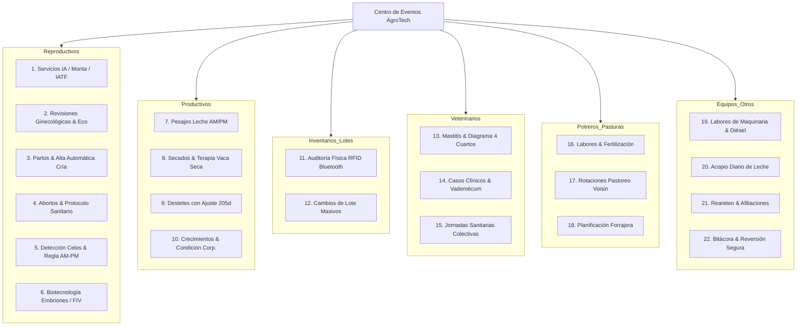
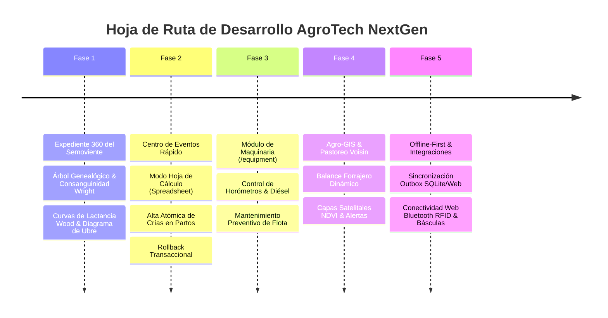

# AgroGan NextGen — Propuesta Integral de Mejoras, Innovación y Nuevas Funcionalidades

> **Documento:** Especificación Estratégica de Mejoras y Nuevas Implementaciones  
> **Sistema Base de Análisis:** GanSoft v1.19.3.0 (`@reference/GanSoft.md`, `@reference/GANSOFT_SPECIFICATION.md`)  
> **Plataforma Destino:** AgroGan (React 19 + TypeScript 5 + Vite 5 + Node.js / PostgreSQL / Offline-First)  
> **Fecha de Elaboración:** 12 de Septiembre de 2026  
> **Estado:** Aprobado para Implementación Arquitectónica  

---

## Tabla de Contenidos

1. [Resumen Ejecutivo y Visión Estratégica](#1-resumen-ejecutivo-y-visión-estratégica)
2. [Matriz Comparativa: GanSoft (Referencia) vs AgroTech NextGen](#2-matriz-comparativa-gansoft-referencia-vs-agrotech-nextgen)
3. [Módulo 1: Expediente 360° del Semoviente (Animal 360)](#3-módulo-1-expediente-360-del-semoviente-animal-360)
   - 3.1 Cabecera Dinámica y Alertas Sanitarias
   - 3.2 Genealogía Dinámica y Cálculo de Consanguinidad (Wright's F)
   - 3.3 Historial Reproductivo con Línea de Tiempo
   - 3.4 Curvas de Lactancia Predictivas y Calidad de Leche
   - 3.5 Crecimiento, Curva Ponderal y Ajustes 205d/365d/540d
   - 3.6 Diagrama Interactivo de Ubre (4 Cuartos + CMT) y Tiempos de Retiro
   - 3.7 Trazabilidad Espacial y Lotes
4. [Módulo 2: Centro de Eventos Inteligente y Transaccionalidad Rápida](#4-módulo-2-centro-de-eventos-inteligente-y-transaccionalidad-rápida)
   - 4.1 Modos de Captura: Quick-Action Modal y Modo Hoja de Cálculo
   - 4.2 Los 22 Submódulos de Eventos Optimizados (6 Categorías)
   - 4.3 Auditoría, Trazabilidad y Reversión Segura (Rollback)
5. [Módulo 3: Agro-GIS, Potreros y Pastoreo Racional Voisin (PRV)](#5-módulo-3-agro-gis-potreros-y-pastoreo-racional-voisin-prv)
   - 5.1 Capas Cartográficas (ArcGIS HD, Topografía, NDVI de Vigor Vegetal)
   - 5.2 Delimitación Vectorial y Balance Forrajero Dinámico (UGG/ha)
   - 5.3 Algoritmo Predictivo de Rotación y Reposo Forrajero
6. [Módulo 4: Maquinaria, Vehículos, Implementos y Combustible (`/equipment`)](#6-módulo-4-maquinaria-vehículos-implementos-y-combustible-equipment)
   - 6.1 Catálogo de Modelos, Variantes y Horómetros
   - 6.2 Vinculación de Labores Agronómicas con Consumo de Diésel
   - 6.3 Mantenimiento Preventivo y Alarmas Operativas
7. [Módulo 5: Centro de Reportes Zootécnicos y Diseñador BI Ad-Hoc](#7-módulo-5-centro-de-reportes-zootécnicos-y-diseñador-bi-ad-hoc)
   - 7.1 Catálogo Maestro de los 23 Informes Zootécnicos
   - 7.2 Campana de Gauss Interactiva para Selección y Culling Genético
   - 7.3 Generador de Reportes Personalizados (`/reports/allreports`)
   - 7.4 Consolidación Multirebaño y Guías de Movilización Pecuaria
8. [Módulo 6: Motor de Reglas Zootécnicas, Alertas y Automatización](#8-módulo-6-motor-de-reglas-zootécnicas-alertas-y-automatización)
   - 8.1 Constantes Biológicas Multi-Especie
   - 8.2 Disparadores Automáticos de Estado y Categoría
   - 8.3 Blindaje de Inocuidad (Bloqueo Automático por Fármacos)
   - 8.4 Catálogos Base Enriquecidos
9. [Módulo 7: Arquitectura Tecnológica, Modo Offline y Hardware IoT](#9-módulo-7-arquitectura-tecnológica-modo-offline-y-hardware-iot)
   - 9.1 Pila Tecnológica y Diseño UI "Estilo AgroTech"
   - 9.2 Arquitectura Offline-First con Cola Outbox Diferida
   - 9.3 Integración Web Bluetooth con Bastones RFID y Balanzas
   - 9.4 Seguridad y Control de Acceso Basado en Roles (RBAC)
10. [Hoja de Ruta de Implementación y Fases](#10-hoja-de-ruta-de-implementación-y-fases)

---

## 1. Resumen Ejecutivo y Visión Estratégica

La plataforma de referencia **GanSoft v1.19.3.0** representa un esfuerzo notable en la captura de requerimientos zootécnicos y médicos del hato bovino tradicional. Sin embargo, su concepción sobre tecnologías heredadas (Blazor Server con dependencia permanente de WebSockets/SignalR, componentes Radzen rígidos, interfaces modales saturadas de clics y ausencia total de soporte para trabajo de campo sin conexión) limita severamente la agilidad del productor moderno.

**AgroTech NextGen** toma todo el rigor zootécnico y los flujos funcionales validados de GanSoft, transformándolos en una solución de clase mundial impulsada por:
1. **Identidad y Estilo Visual AgroTech:** Interfaz limpia en React 19 + TypeScript + Vite, basada en la paleta menta/esmeralda (`#2D6A4F`, `#52B788`, `#F3F5F4`), tipografía moderna *Outfit*, elevaciones suaves y tablas de alta densidad informativa sin saturación visual.
2. **Resiliencia Operativa de Campo (Offline-First):** Sincronización transparente de dos vías (Outbox Queue + IndexedDB / SQLite) para operar en potrero y manga sin cobertura celular.
3. **Zootecnia Predictiva y Genómica Aplicada:** Motores de cálculo en tiempo real para prevención de consanguinidad (Fórmula de Wright), estandarización de lactancias a 305 días (Modelo de Wood), evaluación de mastitis por cuarto mamario y balance forrajero según leyes del Pastoreo Racional Voisin (PRV).
4. **Gestión Total del Predio (Agro + Mecánica + Animal):** Inclusión pionera del módulo de **Maquinaria e Implementos Agrícolas** (`/equipment`), integrando el uso de tractores, combustible y mantenimiento preventivo con las labores agronómicas del predio.

---

## 2. Matriz Comparativa: GanSoft (Referencia) vs AgroTech NextGen

| Dimensión Funcional | GanSoft v1.19.3.0 (Referencia) | AgroTech NextGen (Propuesta Mejorada) | Ventaja Competitiva AgroTech |
| :--- | :--- | :--- | :--- |
| **Arquitectura Frontend** | Blazor Server (.NET 8/9) con WebSockets persistentes (SignalR). | React 19 SPA + Vite 5 + TypeScript 5 desacoplado. | Cero latencia en interacción; funciona sin caídas de conexión. |
| **Experiencia de Usuario (UI/UX)** | Radzen Components, tipografía Poppins, popups densos y modales anidados. | Sistema de diseño AgroTech: Paleta orgánica menta/bosque, fuentes *Outfit*, modales fluídos y drawers laterales. | Mayor ergonomía, legibilidad en exteriores y menor fatiga visual. |
| **Disponibilidad en Campo** | 100% Online requerido; se interrumpe ante cortes de señal 3G/4G rural. | **Offline-First nativo** con Service Workers, IndexedDB en Web y SQLite en App Móvil. | Trabajo continuo en manga de vacunación y potreros remotos. |
| **Expediente del Animal** | Ficha fragmentada en 7 pestañas principales y 10 subpestañas históricas. | **Expediente 360° unificado**: Resumen vitalicio, timeline interactivo de eventos y pestañas contextuales. | Visión holística del semoviente en una sola pantalla navegable. |
| **Control Reproductivo & Pedigrí** | Registro pasivo de padres y ascendientes en tabla fija. | **Árbol genealógico interactivo (3 gen.)** con cálculo automático del **Coeficiente de Consanguinidad (Wright's F)**. | Evita depresión endogámica y pérdida de vigor híbrido antes del servicio. |
| **Control Lechero & Lactancias** | Tabla simple de pesajes AM/PM y cálculo de promedio lineal. | **Curva de lactancia modelada (Wood)** con proyección estandarizada a 305 días, análisis Grasa/Proteína y RCS. | Diagnóstico temprano de acidosis, cetosis y mastitis subclínica. |
| **Salud Mamaria (Mastitis)** | Formulario básico de selección de cuartos y grado CMT. | **Diagrama interactivo de 4 cuartos (AD/AI/PD/PI)** con semáforo CMT y **bloqueo automático de tanque de leche** por retiro farmacológico. | Inocuidad láctea garantizada; cero contaminación de tanques fríos. |
| **Captura en Lote de Eventos** | Formulario registro a registro individual o wizards lentos. | **Modo "Spreadsheet" (Hoja de cálculo en línea)** con navegación por teclado y atajos rápidos (`Cmd/Ctrl + K`). | Registro de pesajes de 200 vacas en minutos sin recargar la página. |
| **Hardware de Campo** | Tipeo manual de aretes numéricos en teclado. | **Conexión Web Bluetooth** directa con bastones lectores RFID/NFC y básculas de corral (Tru-Test, Gallagher). | Cero errores de transcripción humana en corrales de manejo. |
| **Cartografía & Potreros** | Leaflet básico con capas satelitales y dibujo manual. | **Agro-GIS interactivo** con capas NDVI (Vigor Vegetal), topografía, aforos forrajeros y cálculo de presión de carga (UGG/ha). | Manejo regenerativo del suelo y cálculo de biomasa disponible. |
| **Maquinaria & Equipos** | *No disponible en GanSoft.* | **Módulo `/equipment` completo**: Tractores, implementos, horómetros, bitácora de mantenimiento y consumo de diésel por labor. | Control de costos mecanizados y disponibilidad de flota del predio. |
| **Analítica Zootécnica** | 23 reportes tabulares predefinidos con exportación básica. | 23 reportes zootécnicos + **Campana de Gauss interactiva con sliders de selección/descarte** + Diseñador BI ad-hoc (`/reports/allreports`). | Toma de decisiones genéticas y descarte basado en datos biométricos. |

---

## 3. Módulo 1: Expediente 360° del Semoviente (Animal 360)

El expediente individual del animal (`/animales/:id`) evoluciona de una colección estática de tablas hacia un **Cockpit Zootécnico Inteligente**:

```
+----------------------------------------------------------------------------------------------------+
| [<- Volver]  0001 - MARIPOSA  [ACTIVO] [ORDEÑO] [PREÑADA: 142d]              [Descargar PDF] [...] |
| Arete: 0001 | Único: VE-01-0001-92 | Chip RFID: 982.000123849102 | Raza: Carora (75%) x Holstein (25%) |
| Edad: 5,4 Años | Partos: 3 | IEP Prom.: 382d | FPP: 24/11/2026 | Padre: CAR-092 | Madre: 0045     |
| [!] ALERTA SANITARIA: En tratamiento por Mastitis PD. RETIRO DE LECHE ACTIVO hasta 15/09/2026      |
+----------------------------------------------------------------------------------------------------+
| [1. Ficha & Identificación] [2. Genealogía & Consanguinidad] [3. Reproducción] [4. Curvas Lactancia] |
| [5. Desarrollo Ponderal]    [6. Sanidad & Ubre (4Q)]          [7. Trazabilidad Espacial & Lotes]   |
+----------------------------------------------------------------------------------------------------+
```

### 3.1 Cabecera Dinámica y Alertas Sanitarias
- **Badges Zootécnicos de Alta Visibilidad:** Estatus vital (*Activo, Vendido, Descartado, Fallecido*), Situación Reproductiva (*Vacía, Servida, Preñada con conteo diario progresivo, En espera*) y Situación Productiva (*En Ordeño, Seca, Criando*).
- **Banner de Inocuidad y Bioseguridad:** Si el semoviente está bajo tratamiento farmacológico, se activa automáticamente un aviso en color ámbar/rojo indicando los días restantes de retiro en leche y carne, inhabilitando su inclusión accidental en lotes de ordeño o guías de matadero.
- **Acciones Rápidas en Cabecera:**
  - `+ Evento`: Despliega el registrador contextual con el animal ya preseleccionado.
  - `Imprimir Ficha`: Genera una ficha técnica PDF con código QR zootécnico escaneable.
  - `Etiqueta`: Asignación rápida de tags cromáticos (ej. *Vaca Problema*, *Donadora Élite*, *Programa IATF*).

### 3.2 Genealogía Dinámica y Cálculo de Consanguinidad (Wright's F)
Superando el árbol genealógico estático de GanSoft, AgroTech incorpora:
- **Árbol Genealógico Interactivo:** Navegación fluida por nodos expandibles de 3 generaciones (Padres, Abuelos, Bisabuelos).
- **Calculadora de Consanguinidad de Wright ($F_x$):**
  $$\displaystyle F_x = \sum \left( \frac{1}{2} \right)^{n_1 + n_2 + 1} (1 + F_A)$$
  Alerta preventiva si el cruce histórico o un apareamiento simulado supera el umbral crítico del **6.25%**, advirtiendo sobre el riesgo de disminución en producción de leche, fertilidad y supervivencia de la cría.
- **Desglose Fraccional de Pureza Racial:** Gráfico radial de composición de sangres (ej. *Carora 50%, Brahman 25%, Pardo Suizo 25%*).

### 3.3 Historial Reproductivo con Línea de Tiempo (Timeline)
Visualización cronológica interactiva que sustituye las tablas aburridas:
- **Hitos Visuales por Campaña:**
  1. *Detección de Celo*: Marcador de hora y técnico.
  2. *Servicio / IA*: Datos de la pajuela, toro, condición uterina.
  3. *Palpación / Ecografía*: Resultado a los 45 días con hallazgos (CL derecho, folículo ovárico).
  4. *Parto*: Duración de gestación, tipo de parto (*eutócico/distócico*), sexo y peso de la cría.
  5. *Secado*: Días en leche acumulados y aplicación de sellador.
- **KPIs Ginecológicos Clave:** Intervalo Entre Partos (IEP), Días Abiertos, Servicios por Concepción ($S/C$) y Días de Espera Voluntaria (DEV).

### 3.4 Curvas de Lactancia Predictivas y Calidad de Leche
- **Modelo de Curva de Lactancia de Wood:**
  $$\displaystyle y_t = a \cdot t^b \cdot e^{-c \cdot t}$$
  Permite contrastar la producción real del animal contra la curva estándar de la hacienda y proyectar la **Producción Equivalente a 305 Días**.
- **Control Lechero AM / PM:** Gráfico de evolución periódica con análisis de relación **Grasa / Proteína** ($G/P$ ideal entre 1.1 y 1.3).
  - $G/P < 1.0$: Alerta de Acidosis Ruminal Subaguda (SARA).
  - $G/P > 1.4$: Alerta de balance energético negativo / Cetosis.
- **Monitoreo de Células Somáticas (RCS):** Indicador gráfico de riesgo de mastitis subclínica cuando el conteo supera las 200,000 cel/ml.

### 3.5 Crecimiento, Curva Ponderal y Ajustes Zootécnicos
- **Pesajes Ajustados Estándar:**
  - Peso ajustado al destete (205 días).
  - Peso ajustado al año (365 días).
  - Peso ajustado a los 18 meses (540 días).
- **Ganancia Diaria de Peso (GDP):** Cálculo diferencial instantáneo entre pesajes consecutivos con gráfica de velocidad de crecimiento (g/día).
- **Escala de Condición Corporal (CC 1 a 5):** Registro visual con comparativa fotográfica para ajustar raciones alimenticias.

### 3.6 Diagrama Interactivo de Ubre (4 Cuartos) y Tiempos de Retiro
Innovación gráfica exclusiva para AgroTech:

```
                  [ ANTERIOR ]
           +-----------+-----------+
           |    AD     |    AI     |
           | [Normal]  | [ CMT-1 ] |
           +-----------+-----------+
           |    PD     |    PI     |
           | [ CMT-3 ] | [Normal]  |
           +-----------+-----------+
                  [ POSTERIOR ]
```

- **Mapeo Anatómico Cuarto por Cuarto:** Evaluación clínica independiente para Anterior Derecho (AD), Anterior Izquierdo (AI), Posterior Derecho (PD) y Posterior Izquierdo (PI).
- **California Mastitis Test (CMT):** Registro de reacción (*Negativo, Trazas, Grado 1, 2 o 3*).
- **Asignación Farmacológica:** Vinculación directa con el catálogo de tratamientos. Al prescribir un intramamario con retiro de 72 horas, el sistema calcula la fecha y hora exacta de liberación y envía una orden preventiva a la sala de ordeño.

### 3.7 Trazabilidad Espacial y Lotes
- Historial georreferenciado de traslados: qué días estuvo el animal en cada potrero, con qué lote compartió pastura y qué carga animal experimentó en cada rotación.

---

## 4. Módulo 2: Centro de Eventos Inteligente y Transaccionalidad Rápida

El Centro de Eventos (`/eventos`) se rediseña como el motor de captura de alta velocidad de la finca.

### 4.1 Modos de Captura: Quick-Action Modal y Modo Hoja de Cálculo
1. **Quick-Action Modal (`Cmd / Ctrl + K`):** Búsqueda reactiva de animal y registro de evento en menos de 10 segundos con auto-enfoque y navegación completa por teclado.
2. **Modo Hoja de Cálculo (*Spreadsheet Grid Mode*):**
   - Diseñado para jornadas masivas de control lechero en ordeño o pesajes en manga.
   - Grilla editable similar a Excel: una columna para Arete, otra para Peso AM, otra para Peso PM. El usuario pasa de fila con la tecla `Enter`, guardando hasta 100 registros en bloque con validación instantánea.

### 4.2 Los 22 Submódulos de Eventos Optimizados (6 Categorías)



#### Novedades y Mejoras Clave por Evento:
1. **Servicios:**
   - Verificación automática de parentesco entre la hembra y el semental antes de confirmar la inseminación.
   - Selección rápida de pajuela directamente del inventario del termo criogénico con control de stock de dosis de semen.
2. **Partos:**
   - **Alta Atómica de la Cría:** Al registrar el parto, la cría se inserta automáticamente en el catálogo de animales con su arete, sexo, peso al nacer, color y madre asignada, sin tener que ir al módulo de animales.
   - Actualización en cascada del estatus de la madre a *Lactando / En Ordeño*, creando la nueva campaña de lactancia en base de datos.
3. **Secados:**
   - Opción integrada de **Destete Simultáneo**: Si la vaca tenía cría al pie, permite registrar en un solo paso el secado de la madre y el destete de la cría con su peso y lote receptor.
4. **Inventarios Físicos:**
   - Conciliador con bastón RFID: el operario pasa por el corral leyendo aretes electrónicos y la pantalla pinta en verde los animales confirmados, en amarillo los animales de otros lotes (sobrantes) y en rojo los animales no leídos (faltantes).
5. **Acopio Diario de Leche:**
   - Conciliación entre la suma de los pesajes individuales de las vacas y el volumen real recibido en el tanque frío de enfriamiento o despachado a la planta láctea.

### 4.3 Auditoría, Trazabilidad y Reversión Segura (Rollback)
- **Registro Inmutable de Modificaciones:** Cada evento guarda el usuario creador, timestamp ISO y estado anterior.
- **Rollback Transaccional:** Si un operario registró un parto erróneo, la reversión elimina limpiamente la cría generada por error y devuelve la madre a su estado gestante anterior sin romper la integridad de la base de datos.

---

## 5. Módulo 3: Agro-GIS, Potreros y Pastoreo Racional Voisin (PRV)

El módulo de Mapas (`/mapas`) y Potreros (`/potreros`) se convierte en una herramienta agronómica de precisión para el manejo agroecológico y regenerativo.

### 5.1 Capas Cartográficas de Alta Precisión
- **Capa Satelital HD:** Integración con ArcGIS World Imagery y Google Satellite.
- **Capa NDVI (Índice de Vegetación de Diferencia Normalizada):** Monitoreo del vigor fotosintético de las pasturas vía satélite (Sentinel-2 / Copernicus), permitiendo identificar potreros con alta biomasa lista para pastoreo y áreas degradadas con déficit nutricional.
- **Capa Topográfica y Curvas de Nivel:** Útil para planificar líneas de agua, bebederos centrales y acueductos por gravedad.

### 5.2 Delimitación Vectorial y Balance Forrajero Dinámico (UGG/ha)
- Herramienta de polígonos interactivos con cálculo instantáneo de:
  - **Superficie Útil de Pastoreo (ha)**.
  - **Perímetro en metros lineales** (para presupuestar postes y alambre de cerca eléctrica).
- **Cálculo de Carga Animal en Tiempo Real:**
  $$\displaystyle \text{Carga Animal (UGG/ha)} = \frac{\sum \text{UGG Presentes}}{\text{Área del Potrero (ha)}}$$
  *(Donde 1 UGG = 450 kg de peso vivo bovino).*

### 5.3 Algoritmo Predictivo de Rotación y Reposo Forrajero
Implementación del estándar de **Pastoreo Racional Voisin (PRV)**:
- **Demanda Forrajera del Lote:**
  $$\displaystyle \text{Consumo Diario (kg MS)} = \text{UGG Totales} \times 450 \text{ kg} \times 2.8\% \text{ PV}$$
- **Oferta Forrajera Disponible:** Obtenida del aforo en potrero ($\text{kg MV/m}^2 \times \% \text{MS} \times \text{Área útil}$).
- **Semáforo y Recomendador de Rotación:**
  - **Verde (Punto Óptimo de Reposo):** Pasto maduro listo para pastorear (ej. 32 a 40 días de descanso en pasto Mombaza).
  - **Amarillo (En Ocupación):** Lote pastando activamente (máximo 1 a 2 días de ocupación para evitar que el animal coma el rebrote tierno).
  - **Rojo (Sobrepastoreo):** Alerta automática si el lote excede los días de ocupación permitidos.
  - **Azul (En Descanso):** Contabilizador regresivo de días de recuperación.

---

## 6. Módulo 4: Maquinaria, Vehículos, Implementos y Combustible (`/equipment`)

Una innovación estructural de AgroTech que **no existe en la referencia GanSoft**: la gestión mecanizada de la producción ganadera.

### 6.1 Catálogo de Modelos, Variantes y Horómetros
- **Jerarquía de Equipos:**
  - *Categoría:* Maquinaria Pesada, Vehículos de Apoyo, Implementos Forrajeros, Equipos Estacionarios.
  - *Modelos & Variantes:* Potencia (HP), Tracción (4x2 / 4x4), Capacidad de tolva, Ancho de corte.
- **Odómetro y Horómetro Digital:** Registro acumulativo de horas de trabajo y kilometraje.

### 6.2 Vinculación de Labores Agronómicas con Consumo de Diésel
- Al registrar una labor de potrero (ej. *Rastreo o Ensilaje en Potrero 4*), se selecciona el tractor y el implemento utilizado.
- El sistema calcula el rendimiento operativo:
  $$\displaystyle \text{Eficiencia Forrajera} = \frac{\text{Litros de Diésel Consumidos}}{\text{Hectárea Trabajada (L/ha)}}$$

### 6.3 Mantenimiento Preventivo y Alarmas Operativas
- **Alertas por Ciclos de Horas:**
  - Cambio de aceite de motor cada 250 horas.
  - Cambio de filtros hidráulicos cada 500 horas.
  - Engrase general y calibración de discos de corte.
- **Historial de Reparaciones:** Costo de repuestos, mecánicos responsables y tiempos de parada.

---

## 7. Centro de Reportes Zootécnicos y Diseñador BI Ad-Hoc

El módulo de Reportes (`/reportes`) organiza la analítica del hato en 4 categorías maestras con 23 informes preconfigurados y añade un motor de consulta a medida.

### 7.1 Catálogo Maestro de los 23 Informes Zootécnicos

```
+--------------------------------------------------------------------------------------------------+
|  Centro de Reportes AgroTech                                               [+ Diseñar Informe]   |
|  [Q Buscar reporte por código o nombre...]                                                        |
+--------------------------------------------------------------------------------------------------+
| 1. REPORTES DE GESTIÓN (5)            | 2. REPORTES DE ANIMALES (8)                              |
| > Inventario Demográfico y UGG        | > Padrón General de Vientres                             |
| > Movimientos y Traslados Internos    | > Vacas Próximas a Secar (Alertas 15/30d)                |
| > Distribución Normal (Gauss)         | > Vacas Próximas al Parto (Maternidad)                   |
| > Rendimiento de Técnicos e IA        | > Hembras Próximas a Revisar Ginecológicamente           |
| > Evaluación de Toros y Reproductores | > Censo de Animales Secos                                |
|                                       | > Vacas en Ordeño y Producción Activa                    |
|                                       | > Vacas Criando con Cría al Pie                          |
|                                       | > No Vientres (Levante, Recría y Ceba)                   |
+---------------------------------------+----------------------------------------------------------+
| 3. REPORTES HISTÓRICOS (4)            | 4. REPORTES MULTIREBAÑOS (6)                             |
| > Historia Vitalicia de Reproducción  | > Inventario Patrimonial Consolidado                     |
| > Desempeño Inter-Lactancias          | > Comparativa Reproductiva entre Haciendas               |
| > Curvas Históricas de Pesajes Leche  | > Distribución de Preñez por Trimestre                   |
| > Evolución de Pesos y Ganancia Diaria| > Eficiencia y Porcentaje de Hato en Ordeño              |
|                                       | > Guías de Movilización y Transferencias                 |
|                                       | > Balance Diario de Acopio Lechero Global                |
+--------------------------------------------------------------------------------------------------+
```

### 7.2 Campana de Gauss Interactiva para Selección y Culling Genético
En el reporte de **Distribución Normal** (`/reportes/distribucion-normal`):
- Gráfico dinámico de densidad de probabilidad gaussiana renderizado con Chart.js.
- Visualización de la media ($\mu$), desviación estándar ($\sigma$) y cuartiles.
- **Sliders Interactivos de Selección Genética:** El usuario puede mover el umbral inferior para identificar instantáneamente el 10% inferior del rebaño (candidatas prioritarias a descarte o venta) y el 10% superior (donadoras para inseminación con semen sexado o transferencia de embriones).

### 7.3 Generador de Reportes Personalizados (`/reports/allreports`)
Herramienta de Business Intelligence ganadero sin código:
- **Entidad Raíz:** Animales, Lactancias, Pesajes de Leche, Tratamientos Sanitarios o Potreros.
- **Constructor Visual de Filtros:** Operadores lógicos (`AND` / `OR`, rangos de fechas, categorías, lotes).
- **Columnas Calculadas Dinámicas:** Capacidad de crear fórmulas personalizadas (ej. $\text{Producción Total} / \text{DEL}$).
- **Exportación Multi-Formato:** Generación instantánea de planillas Excel (`.xlsx`) con estilos profesionales y documentos PDF imprimibles con membrete corporativo de la hacienda.

### 7.4 Consolidación Multirebaño y Guías de Movilización Pecuaria
Para productores con múltiples fincas o grupos corporativos:
- Comparativa de indicadores clave entre predios: % de preñez, promedio de leche por vaca, IEP promedio y carga animal global.
- **Emisión Digital de Guías de Movilización Pecuaria:** Registro de transferencias de animales entre fincas con control de precintos, datos de chofer/camión y certificado sanitario de origen.

---

## 8. Motor de Reglas Zootécnicas, Alertas y Automatización

El módulo de Ajustes (`/ajustes`) centraliza la lógica biológica del sistema, eliminando tareas manuales repetitivas.

### 8.1 Constantes Biológicas Multi-Especie
Soporte parametrizable según la especie de la explotación:
- **Vacunos:** Gestación promedio de 283 a 285 días; celos cada 21 días.
- **Bufalinos:** Gestación promedio de 310 a 315 días.
- **Ovinos y Caprinos:** Gestación de 150 días.
- **Días de Espera Voluntaria (DEV):** 45 a 60 días predeterminados.
- **Período Seco Ideal:** 60 días antes del parto.

### 8.2 Disparadores Automáticos de Estado y Categoría
- **Transición por Edad:**
  - `Becerra` $\to$ `Mauta` automáticamente a los 8 meses.
  - `Mauta` $\to$ `Novilla` al alcanzar los 18 meses o 320 kg de peso.
- **Transición por Evento:**
  - `Novilla` $\to$ `Vaca` inmediatamente tras registrar su primer parto.
  - Situación Reproductiva $\to$ `Preñada` tras confirmación ecográfica positiva.
  - Situación Productiva $\to$ `Seca` tras el registro del secado.

### 8.3 Blindaje de Inocuidad (Bloqueo Automático por Fármacos)
- Cuando se registra la aplicación de un medicamento con tiempo de retiro (ej. Ivermectina o Cefalosporinas):
  - El sistema bloquea al semoviente para la emisión de guías de matadero durante los días de retiro en carne.
  - Se genera una alerta crítica en la lista de ordeño diario para desviar la leche del animal y evitar contaminar el tanque de acopio.

### 8.4 Catálogos Base Enriquecidos
- **Lotes:** Definición de grupos con dietas asignadas y potreros preferenciales.
- **Colores:** Paleta de colores para aretes visuales con muestra cromática hex (`#F0AE4D`, `#2D6A4F`).
- **Propietarios:** Registro de socios con porcentaje de tenencia y archivo digital de la marca de fuego (hierro).
- **Diagnósticos:** Nomenclatura veterinaria indexada por sistemas orgánicos (Mamario, Reproductivo, Podal, Digestivo, Respiratorio).
- **Tratamientos (Vademécum):** Fármaco, principio activo, vía de administración, dosis sugerida y días de retiro.
- **Clasificaciones:** Escalas zootécnicas de conformación lineal de ubre y aplomos.

---

## 9. Arquitectura Tecnológica, Modo Offline y Hardware IoT

### 9.1 Pila Tecnológica y Diseño UI "Estilo AgroTech"

```
+--------------------------------------------------------------------------------------------------+
|                                    ARQUITECTURA AGROTECH NEXTGEN                                 |
+--------------------------------------------------------------------------------------------------+
| [CLIENTE WEB]                   | [CLIENTE MÓVIL]              | [HARDWARE & IOT]                |
| React 19 + Vite 5 + TypeScript 5 | Flutter (Android / iOS)      | Bastones RFID Allflex/Tru-Test  |
| Chart.js 4 + Lucide Icons       | SQLite Local + Background    | Básculas de Corral Bluetooth    |
| CSS Variables + Outfit Font     | Sync Worker                  | Antenas de Paso en Sala Ordeño  |
+---------------------------------+------------------------------+---------------------------------+
|                                     COLA DE SINCRONIZACIÓN (OUTBOX)                              |
+--------------------------------------------------------------------------------------------------+
| [BACKEND API REST & GRAPHQL]                                                                     |
| Node.js 20+ con TypeScript + Express / NestJS                                                    |
| Multi-Tenancy Aislado por Hacienda (AppContext)                                                 |
| Autenticación JWT Stateless con RBAC y Logs de Auditoría Inmutables                              |
+--------------------------------------------------------------------------------------------------+
| [BASE DE DATOS & CAPA GEOGRÁFICA]                                                                |
| PostgreSQL 16 + PostGIS (Georreferenciación de Potreros y Capas Satelitales)                      |
| Redis para Caché de KPIs y Sesiones                                                             |
+--------------------------------------------------------------------------------------------------+
```

### 9.2 Arquitectura Offline-First con Cola Outbox Diferida
Para el trabajo en corrales y potreros sin conexión a internet:
1. El operario interactúa con la aplicación normalmente; los eventos se persisten inmediatamente en la base de datos local con estado `pending_sync`.
2. La interfaz actualiza los datos de inmediato de forma optimista.
3. Al detectar señal WiFi o datos móviles, el motor en segundo plano procesa la cola de transacciones hacia el servidor cloud, resolviendo conflictos mediante marcas de tiempo (`updated_at`) y reglas deterministas de negocio.

### 9.3 Integración Web Bluetooth con Bastones RFID y Balanzas
- Mediante la API moderna **Web Bluetooth**, AgroTech se conecta directamente a:
  - Bastones lectores de aretes electrónicos (Allflex RS420, Tru-Test SRS2/XRS2).
  - Indicadores de peso electrónicos (Tru-Test S3/XR5000, Gallagher W-0).
- Al ingresar el animal al brete, el bastón transmite el código RFID instantáneamente a la pantalla de AgroTech, abriendo su ficha y cargando el peso de la balanza con un solo clic.

### 9.4 Seguridad y Control de Acceso Basado en Roles (RBAC)
- **Propietario / Director:** Acceso total, reportes económicos, ajustes maestros y multirebaño.
- **Administrador de Finca:** Gestión de animales, eventos, potreros y maquinaria.
- **Médico Veterinario:** Acceso enfocado a reproducción, diagnósticos, mastitis, vademécum y sanidad.
- **Inseminador / Técnico de Campo:** Registro rápido de servicios, celos y palpaciones.
- **Operario de Corral / Ordeñador:** Modo simplificado para pesajes de leche y movimientos de potrero.

---

## 10. Hoja de Ruta de Implementación y Fases



| Fase | Alcance Principal | Entregables Técnicos | Impacto Operativo |
| :--- | :--- | :--- | :--- |
| **Fase 1: Expediente 360°** | Ficha completa del animal con biometría avanzada. | Componente `FichaAnimal360`, Curva de Wood (Chart.js), Diagrama 4Q de Ubre y Coeficiente de Wright. | Visión clínica y genética total del semoviente en un solo clic. |
| **Fase 2: Centro de Eventos** | Transaccionalidad de alta velocidad y 22 submódulos. | `EventosSpreadsheetGrid`, modal unificado `Cmd+K`, creación atómica de crías y rollback. | Reducción del 80% en tiempo de carga de datos en manga. |
| **Fase 3: Maquinaria** | Control de implementos y tractores (`/equipment`). | Catálogo de variantes de equipos, registro de combustible por labor y calendario de mantenimiento. | Control riguroso de costos mecanizados del predio. |
| **Fase 4: Agro-GIS & PRV** | Cartografía inteligente y Pastoreo Racional Voisin. | Capas satelitales NDVI, cálculo dinámico de UGG/ha y semáforo de reposo forrajero. | Mayor aprovechamiento de pasturas y prevención de sobrepastoreo. |
| **Fase 5: Offline & IoT** | Conectividad de campo e integración de hardware. | Sincronización Outbox diferida, Web Bluetooth para RFID y balanzas electrónicas. | Cero dependencia de internet en potrero y eliminación de errores manuales. |

---

> **Conclusión:** Con esta especificación arquitectónica, **AgroTech** no solo hereda y respeta la exhaustividad zootécnica de GanSoft, sino que la transforma en un ecosistema ganadero moderno, ultra-rápido, estéticamente impecable y preparado para el futuro de la ganadería regenerativa y de precisión.
