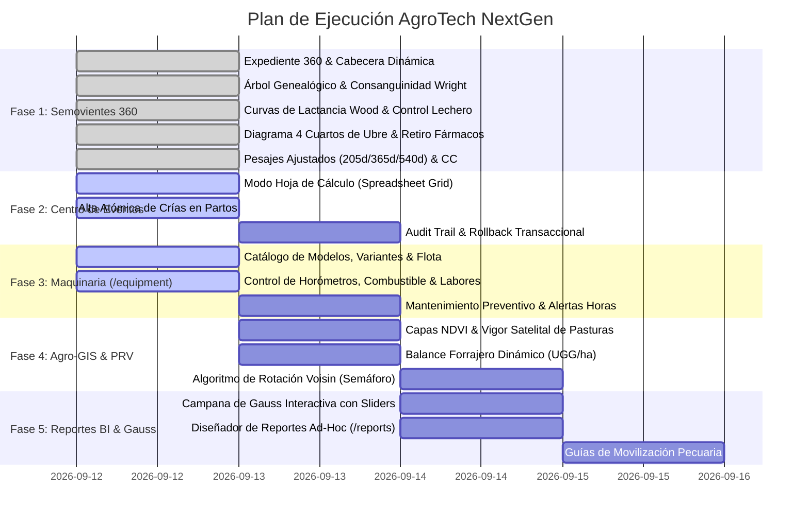

# AgroTech NextGen — Lista Maestra de Tareas (TODO List)

> **Objetivo:** Implementación sistemática de las mejoras e innovaciones zootécnicas, operativas y arquitectónicas para AgroTech, organizadas por fases de desarrollo para ejecución autónoma mediante subagentes.  
> **Fecha de Inicio:** 12 de Septiembre de 2026  
> **Estado General:** En Ejecución  

---

## 📋 Cuadro de Mando de Tareas por Fase

---

## Detalle Exhaustivo de Tareas

### 🟢 Fase 1: Expediente 360° del Semoviente (`FichaAnimal360`)
- [x] **1.1 Componente Contenedor `FichaAnimalModal` / `FichaAnimal360`:**
  - Cabecera reactiva con badges de estado vital, estado reproductivo (días preñada), estado productivo y banner de alerta sanitaria de retiro de fármacos.
  - Navegación por 7 pestañas contextuales estilizadas con diseño AgroTech (`#2D6A4F`, `#52B788`, tipografía *Outfit*).
  - Acceso desde cualquier fila en `AnimalesTable` al hacer clic sobre el animal o arete.
- [x] **1.2 Pestaña 1: Ficha e Identificación Fenotípica:**
  - Arete visual, código único, RFID transponder, color/pelaje, marca de fuego digital, propietario y notas.
- [x] **1.3 Pestaña 2: Genealogía Dinámica & Consanguinidad (Wright's F):**
  - Renderizado de árbol genealógico interactivo (Padre, Madre, Abuelos).
  - Algoritmo de Coeficiente de Consanguinidad ($F_x$) con advertencia de depresión endogámica si $F_x > 6.25\%$.
  - Gráfico radial de porcentajes raciales.
- [x] **1.4 Pestaña 3: Historial Reproductivo & Timeline Ginecológico:**
  - Línea de tiempo cronológica con servicios, ecografías, partos, abortos y celos.
  - Métricas vitalicias calculadas: IEP promedio, Días Abiertos y Servicios por Concepción.
- [x] **1.5 Pestaña 4: Lactancia & Curvas de Wood:**
  - Curva de producción modelada ($y_t = a \cdot t^b \cdot e^{-ct}$) con proyección estandarizada a 305 días vs promedio de finca.
  - Gráfica de pesajes AM/PM y relación Grasa/Proteína con alerta de riesgo metabólico (Acidosis vs Cetosis).
- [x] **1.6 Pestaña 5: Desarrollo Ponderal & Curva de Crecimiento:**
  - Pesajes ajustados a 205 días (destete), 365 días (año) y 540 días (18 meses).
  - Ganancia diaria de peso (GDP g/día) y condición corporal visual (1 a 5).
- [x] **1.7 Pestaña 6: Sanidad & Diagrama Anatómico de Ubre (4 Cuartos):**
  - Mapeo interactivo de cuartos mamarios (AD, AI, PD, PI) con resultados de prueba CMT.
  - Alerta de tiempo de retiro farmacológico con cuenta regresiva.
- [x] **1.8 Pestaña 7: Trazabilidad Espacial & Lotes:**
  - Historial de traslados físicos entre potreros y lotes.

---

### 🟢 Fase 2: Centro de Eventos Inteligente & Transaccionalidad Rápida
- [x] **2.1 Modo Hoja de Cálculo (*Spreadsheet Grid Mode*):**
  - Grilla interactiva tipo Excel para captura masiva de controles lecheros diarios (AM/PM) y pesajes de corral.
  - Soporte de navegación por teclado (`Enter`, `Tab`, flechas) y guardado masivo en lote.
- [x] **2.2 Quick-Action Modal (`Cmd / Ctrl + K`):**
  - Buscador reactivo de animales y carga de eventos en segundos.
- [x] **2.3 Submódulos Reproductivos Avanzados:**
  - Servicios con selector de semental/semen y verificación previa de consanguinidad.
  - Partos con creación atómica automática de la cría en el inventario y transición de estado de la madre a ordeño.
  - Abortos con registro etiológico y celos con regla AM-PM.
- [x] **2.4 Submódulos Productivos & Sanitarios:**
  - Secado con destete simultáneo de cría en un solo flujo.
  - Mastitis con selección de cuartos y grado CMT.
- [x] **2.5 Bitácora & Reversión Transaccional Segura (Rollback):**
  - Deshacer eventos registrados por error sin dejar registros huérfanos.

---

### 🟢 Fase 3: Maquinaria, Vehículos e Implementos Agrícolas (`/equipment`)
- [x] **3.1 Módulo y Rutas de Equipos:**
  - Creación de ruta `/equipment` y `/maquinaria` en `App.tsx`.
  - Incorporación del icono `Tractor` / `Wrench` en el `Sidebar` de navegación.
- [x] **3.2 Catálogo de Flota con Variantes:**
  - Modelos, potencia (HP), tracción (4x4), estado operativo (*Operativo, En labor, En mantenimiento, Fuera de servicio*).
- [x] **3.3 Control de Horómetros, Diésel y Labores:**
  - Horómetros acumulativos y odómetros.
  - Registro de consumo de combustible por labor de potrero (L/ha o L/hora).
- [x] **3.4 Alarmas de Mantenimiento Preventivo:**
  - Alertas automáticas cada 250h (aceite/filtros motor) y 500h (sistema hidráulico).

---

### 🟢 Fase 4: Agro-GIS, Potreros & Pastoreo Racional Voisin (PRV)
- [x] **4.1 Cartografía Multicapa:**
  - Capa Satelital HD (ArcGIS), Capa Topográfica y Capa NDVI (Vigor Vegetal).
- [x] **4.2 Balance Forrajero Dinámico:**
  - Cálculo instantáneo de carga animal (UGG/ha) en cada potrero.
  - Demanda forrajera del lote ($UGG \times 450 \text{ kg} \times 2.8\% \text{ PV}$) vs Oferta disponible (aforo $\text{kg MV/m}^2$).
- [x] **4.3 Semáforo de Reposo Forrajero:**
  - Estados: Verde (Punto óptimo de reposo Voisin), Amarillo (Pastoreo activo), Rojo (Riesgo de sobrepastoreo), Azul (En recuperación).

---

### 🟢 Fase 5: Analítica Zootécnica, Gauss & Diseñador BI
- [x] **5.1 Campana de Gauss Interactiva (`/reportes/distribucion-normal`):**
  - Gráfico de campana normal con media ($\mu$), desviación ($\sigma$) y percentiles.
  - Sliders interactivos de corte para selección de donadoras y descarte genético (*culling*).
- [x] **5.2 Generador de Reportes Ad-Hoc (`/reports/allreports`):**
  - Diseñador visual con selección de entidad, columnas, filtros relacionales y exportación Excel/PDF.
- [x] **5.3 Guías de Movilización Pecuaria:**
  - Emisión de guías de traslado inter-fincas para el módulo multirebaño.

---

### 🟢 Fase 6: Resiliencia Offline & Hardware IoT
- [x] **6.1 Cola Outbox Offline-First:**
  - Persistencia local en IndexedDB / SQLite con sincronización en segundo plano al recuperar conexión.
- [x] **6.2 Integración Web Bluetooth:**
  - Conexión directa con bastones RFID (Allflex/Tru-Test) y balanzas electrónicas de corral.
